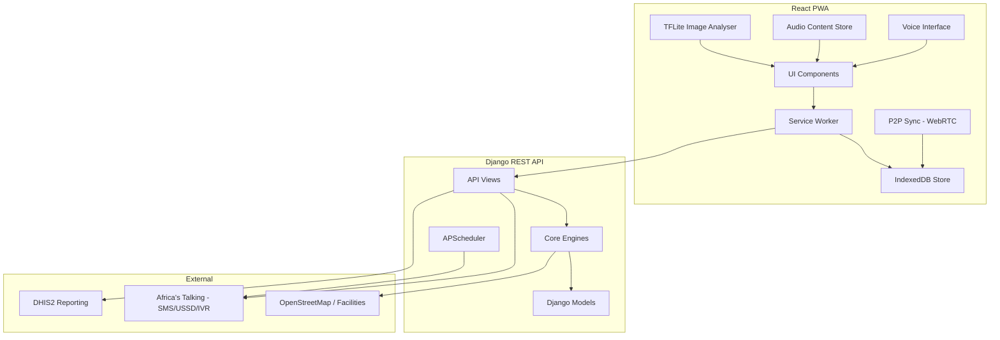
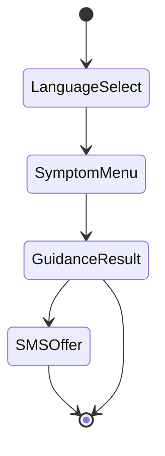

# Design Document: Rural Community Enhancements

## Overview

This document describes the technical design for enhancing the AI Health Assistant to better serve rural Ethiopian communities. The existing system is a Django REST API backend with a React PWA frontend, supporting symptom assessment, facility finding, medication lookup, CHW tools, SMS reminders, and analytics across five languages.

The enhancements address eight rural challenges: intermittent connectivity, low literacy, feature-phone access, limited language coverage, low community trust, expensive mobile data, unreliable electricity, and the need to integrate traditional medicine knowledge.

The work is organised into eight feature areas:

1. **Voice Interface** — Web Speech API + Language Pack audio fallback
2. **USSD/IVR Gateway** — Africa's Talking feature-phone access
3. **Aggressive Offline Mode** — Service Worker + IndexedDB + Background Sync
4. **Audio Health Tips** — Pre-recorded multilingual audio content store
5. **Image-Based Symptom Reporting** — On-device TensorFlow Lite classification
6. **Traditional Medicine KB** — Curated remedy knowledge base with interaction checking
7. **Emergency Contact Tree** — Multi-contact SMS alerting on emergency urgency
8. **Community Calendar + Referral Tracker** — Shared event scheduling and referral follow-up

Non-functional requirements cover performance on low-resource devices, data privacy, accessibility for low-literacy users, cultural sensitivity, and connectivity/power resilience.

---

## Architecture

The system follows the existing layered architecture and extends it with new subsystems:



### Key Architectural Decisions

- **Offline-first**: The Service Worker intercepts all API calls and serves IndexedDB-cached responses when offline. New data is queued in a `pending_sync` table and replayed on reconnection.
- **On-device ML**: TensorFlow Lite runs entirely in the browser (via `@tensorflow/tfjs` + a bundled `.tflite` model converted to TF.js format), requiring no network for image classification.
- **Language Packs as downloadable bundles**: Each language pack is a single JSON/ZIP bundle containing UI strings, audio clips (32 kbps MP3), and IVR prompts. Packs are stored in IndexedDB and the Cache API.
- **USSD/IVR as a stateless flow**: USSD sessions are handled by a new Django view that maps Africa's Talking webhook payloads to a simple state machine. No session state is stored server-side beyond the AT session ID.
- **Emergency alerts via existing SMS engine**: The Emergency Alert Engine reuses `core/sms_engine.py` and adds a contact registry model and a queuing mechanism for offline scenarios.
- **Traditional Medicine KB as a JSON file**: Follows the same pattern as `data/knowledge_base.json`, loaded at startup and cached. Updatable by admins via a new API endpoint without redeployment.

---

## Components and Interfaces

### 1. Voice Interface (`VoiceInterface`)

**Location**: `frontend/src/components/VoiceInterface.js` + `frontend/src/hooks/useVoice.js`

**Responsibilities**:
- Capture audio via `window.SpeechRecognition` / `webkitSpeechRecognition`
- Display transcription and read it back via `window.speechSynthesis`
- Fall back to Language Pack pre-recorded audio when the Web Speech API does not support the selected language
- Suppress non-essential animations while voice mode is active
- Offer to send assessment result as SMS on completion

**Interface**:
```js
// useVoice hook
{
  isListening: boolean,
  transcript: string,
  startListening: () => void,
  stopListening: () => void,
  speak: (text: string, lang: string) => void,
  supported: boolean,
  fallbackAudio: (clipId: string) => void,
}
```

**Language support**: English, Amharic, Oromo, Tigrinya, Sidama (+ 4 new languages from Req 8).

---

### 2. USSD/IVR Gateway

**Location**: `backend/api/ussd_views.py` + `backend/core/ussd_engine.py`

**Responsibilities**:
- Accept Africa's Talking USSD webhook POST (`sessionId`, `phoneNumber`, `text`, `serviceCode`)
- Drive a state machine through: language selection → symptom selection → guidance → optional SMS send
- Accept Africa's Talking IVR webhook and return TwiML-style XML with `<Say>` prompts
- Log all sessions with anonymised identifiers (no PII stored)
- Send SMS summary on session timeout

**USSD State Machine**:


**API Endpoints**:
```
POST /api/ussd/          — Africa's Talking USSD webhook
POST /api/ivr/           — Africa's Talking IVR webhook
GET  /api/ussd/sessions/ — Admin: list anonymised session logs
```

**Response format** (USSD): Plain text, ≤160 chars per page, prefixed `CON` (continue) or `END` (terminate).

---

### 3. Offline Engine & Sync Manager

**Location**: `frontend/public/sw.js` (Service Worker) + `frontend/src/services/syncManager.js` + `frontend/src/services/offlineStore.js`

**Responsibilities**:
- Cache all core assets, knowledge base, facility data, medication data, and Language Packs on first load
- Intercept API requests and serve cached responses when offline
- Queue offline submissions in IndexedDB `pending_sync` table
- Replay queued submissions on reconnection with exponential backoff (max 5 retries)
- Silently refresh stale data (>30 days) in the background
- Store ≥90 days of patient records within 50 MB

**IndexedDB Schema** (new stores added to existing schema):
```
pending_sync:    { id, url, method, body, timestamp, retries, status }
patient_records: { id, type, data, kebele, created_at, synced }
language_packs:  { lang, version, strings, audio_index, downloaded_at }
audio_clips:     { id, lang, category, blob, cached_at }
calendar_events: { id, kebele, event_type, date, title, lang_data }
referrals:       { id, patient_id, chw_id, facility, reason, status, expected_date }
emergency_contacts: { id, user_id, name, phone, relationship }
trad_remedies:   { id, local_names, use, compounds, safety, interactions }
```

**Sync conflict resolution**: Last-write-wins based on `updated_at` timestamp, with a conflict log visible in the CHW Dashboard.

---

### 4. Audio Content Store

**Location**: `frontend/src/services/audioStore.js` + `frontend/src/components/AudioTips.js`

**Responsibilities**:
- Serve pre-recorded audio health tips (32 kbps MP3) from Cache API when offline
- Play cached clips within 1 second; stream within 3 seconds when online
- Support per-language bundle download
- Respect Low Bandwidth Mode (no auto-download)

**Audio categories**: malaria prevention, diarrhoea prevention, maternal health, child nutrition, vaccination importance, hand hygiene — in all 8 supported languages.

**Bundle structure**:
```json
{
  "lang": "am",
  "version": "1.0",
  "clips": [
    { "id": "malaria_01", "category": "malaria", "file": "am_malaria_01.mp3", "duration_s": 45 }
  ]
}
```

---

### 5. Image Analyser

**Location**: `frontend/src/services/imageAnalyser.js` + `frontend/src/components/ImageSymptom.js`

**Responsibilities**:
- Load a bundled TF.js model (`/models/skin_classifier/model.json`)
- Classify images into: wound, rash, skin infection, eye condition, other
- Return confidence score; prompt retake if < 60%
- Compress images to ≤200 KB before upload (with consent)
- Store images locally in encrypted form; auto-delete after 30 days
- Never transmit images without explicit informed consent

**Interface**:
```js
analyseImage(imageBlob: Blob): Promise<{
  category: string,       // 'wound' | 'rash' | 'skin_infection' | 'eye_condition' | 'other'
  confidence: number,     // 0.0 – 1.0
  low_confidence: boolean // true if < 0.60
}>
```

---

### 6. Traditional Medicine Knowledge Base

**Location**: `backend/data/traditional_medicine_kb.json` + `backend/core/trad_medicine_engine.py`

**Responsibilities**:
- Store ≥50 Ethiopian traditional remedy entries
- Look up remedies by local name (fuzzy match) during symptom assessment
- Check interactions against the user's medication list
- Return culturally respectful safety notes
- Support admin updates via API without redeployment
- Display prominent warnings for serious adverse effects

**API Endpoints**:
```
GET  /api/trad-medicine/search/?q=<name>&language=<lang>
GET  /api/trad-medicine/<id>/
POST /api/trad-medicine/check-interactions/   — body: { remedies: [...], medications: [...] }
PUT  /api/trad-medicine/<id>/                 — admin only
```

---

### 7. Emergency Alert Engine

**Location**: `backend/core/emergency_engine.py` + `frontend/src/components/EmergencyAlert.js`

**Responsibilities**:
- Allow users to register up to 5 emergency contacts (name, phone, relationship)
- Trigger on `urgency_level == 'emergency'`
- Send SMS to all contacts within 30 seconds (or queue for 60 s after reconnection)
- Include: user name, condition summary, GPS/nearest location, nearest facility phone + distance
- Provide 10-second cancellation countdown
- Log every alert event in the user's local health record

**API Endpoints**:
```
GET    /api/emergency-contacts/
POST   /api/emergency-contacts/
DELETE /api/emergency-contacts/<id>/
POST   /api/emergency-alert/send/   — triggers alert for current assessment
```

---

### 8. Community Calendar

**Location**: `backend/api/calendar_views.py` + `frontend/src/components/CommunityCalendar.js`

**Responsibilities**:
- Display health events for the user's kebele (next 90 days, offline-capable)
- Push new events to registered devices within 24 hours via Sync Manager
- Allow personal reminders (SMS or in-app, 24 h before event)
- Auto-add child vaccination due dates on child registration
- Display in user's language with pictograms

**API Endpoints**:
```
GET  /api/calendar/?kebele=<kebele>&days=90
POST /api/calendar/                    — CHW/admin: create event
PUT  /api/calendar/<id>/
POST /api/calendar/<id>/remind/        — set personal reminder
```

---

### 9. Referral Tracker

**Location**: `backend/api/referral_views.py` + `frontend/src/components/ReferralTracker.js`

**Responsibilities**:
- Record referrals with: patient ID, CHW, destination facility, reason, referral date, expected visit date
- Display open referrals sorted by expected visit date (offline-capable)
- Generate follow-up tasks when expected date passes without outcome
- Send SMS reminder to patient 3 days after missed expected visit
- Generate monthly summary reports per CHW

**API Endpoints**:
```
GET  /api/referrals/?chw=<id>
POST /api/referrals/
PUT  /api/referrals/<id>/outcome/   — record attended/not attended/admitted/discharged
GET  /api/referrals/report/?chw=<id>&month=<YYYY-MM>
```

---

### 10. Language Pack Manager

**Location**: `backend/api/language_views.py` + `frontend/src/services/languageManager.js`

**Responsibilities**:
- Serve Language Pack bundles for 8 languages (existing 5 + Somali, Afar, Wolaytta, Hadiyya)
- Display download size before initiating download
- Fall back to Amharic (audio) / English (text) when pack not downloaded
- Support dialect variants within a language

**API Endpoints**:
```
GET /api/language-packs/                    — list available packs with sizes
GET /api/language-packs/<lang>/bundle/      — download full pack
GET /api/language-packs/<lang>/audio/       — download audio bundle only
```

---

### 11. Low Bandwidth Mode

**Location**: `frontend/src/context/BandwidthContext.js` + existing `AccessibilityContext.js`

**Responsibilities**:
- Toggle from settings screen
- Disable image/video/audio auto-load; compress payloads to plain text / minimal JSON
- Show data usage estimate before each network action
- Limit API response payloads to ≤2 KB
- Auto-suggest when connection speed < 50 kbps (via Network Information API)
- Cache all session responses in IndexedDB
- Display total session data usage in status bar

**Backend support**: A `?compact=1` query parameter on all API endpoints triggers minimal JSON serialisation (IDs, essential fields only, no nested objects).

---

### 12. P2P Sync

**Location**: `frontend/src/services/p2pSync.js`

**Responsibilities**:
- Establish WebRTC data channel between two devices on the same LAN or Bluetooth
- Display pairing code on initiator; require entry on receiver
- Sync: pending patient records, updated KB entries, Language Pack bundles
- AES-256 encryption of all transmitted data
- Conflict resolution: present both versions to user for explicit selection
- Display transfer summary on completion
- No data sent to external servers during P2P session

---

## Data Models

### New Django Models

```python
# backend/api/models.py additions

class EmergencyContact(models.Model):
    user_identifier = models.CharField(max_length=100)  # local device ID or phone
    name = models.CharField(max_length=100)
    phone = models.CharField(max_length=20)
    relationship = models.CharField(max_length=50)
    created_at = models.DateTimeField(auto_now_add=True)

    class Meta:
        constraints = [
            models.CheckConstraint(
                check=models.Q(phone__regex=r'^\+?[0-9]{7,15}$'),
                name='valid_phone_format'
            )
        ]


class EmergencyAlertLog(models.Model):
    user_identifier = models.CharField(max_length=100)
    condition_summary = models.TextField()
    urgency_level = models.CharField(max_length=30)
    contacts_notified = models.JSONField(default=list)  # list of phone numbers
    location_text = models.CharField(max_length=200, blank=True)
    nearest_facility = models.CharField(max_length=200, blank=True)
    sent_at = models.DateTimeField(auto_now_add=True)
    cancelled = models.BooleanField(default=False)


class CalendarEvent(models.Model):
    EVENT_TYPES = [
        ('vaccination_day', 'Vaccination Day'),
        ('chw_visit', 'CHW Visit'),
        ('anc_clinic', 'ANC Clinic'),
        ('health_education', 'Health Education Session'),
        ('other', 'Other'),
    ]
    kebele = models.CharField(max_length=100, db_index=True)
    event_type = models.CharField(max_length=30, choices=EVENT_TYPES)
    event_date = models.DateField(db_index=True)
    title_en = models.CharField(max_length=200)
    title_am = models.CharField(max_length=200, blank=True)
    title_ti = models.CharField(max_length=200, blank=True)
    title_om = models.CharField(max_length=200, blank=True)
    created_by = models.CharField(max_length=100, blank=True)  # CHW or admin ID
    created_at = models.DateTimeField(auto_now_add=True)
    updated_at = models.DateTimeField(auto_now=True)


class PersonalReminder(models.Model):
    CHANNEL_CHOICES = [('sms', 'SMS'), ('in_app', 'In-App')]
    user_identifier = models.CharField(max_length=100)
    calendar_event = models.ForeignKey(CalendarEvent, on_delete=models.CASCADE,
                                        related_name='reminders')
    phone = models.CharField(max_length=20, blank=True)
    channel = models.CharField(max_length=10, choices=CHANNEL_CHOICES, default='sms')
    remind_at = models.DateTimeField()  # event_date - 24h
    sent = models.BooleanField(default=False)
    created_at = models.DateTimeField(auto_now_add=True)


class Referral(models.Model):
    STATUS_CHOICES = [
        ('open', 'Open'),
        ('attended', 'Attended'),
        ('not_attended', 'Not Attended'),
        ('admitted', 'Admitted'),
        ('discharged', 'Discharged'),
    ]
    referral_id = models.CharField(max_length=50, unique=True)
    patient_identifier = models.CharField(max_length=100)
    patient_name = models.CharField(max_length=100, blank=True)
    patient_phone = models.CharField(max_length=20, blank=True)
    chw_identifier = models.CharField(max_length=100)
    destination_facility = models.CharField(max_length=200)
    reason = models.TextField()
    referral_date = models.DateField()
    expected_visit_date = models.DateField()
    status = models.CharField(max_length=20, choices=STATUS_CHOICES, default='open')
    outcome_notes = models.TextField(blank=True)
    outcome_recorded_at = models.DateTimeField(null=True, blank=True)
    sms_reminder_sent = models.BooleanField(default=False)
    created_at = models.DateTimeField(auto_now_add=True)
    updated_at = models.DateTimeField(auto_now=True)


class TraditionalRemedy(models.Model):
    remedy_id = models.CharField(max_length=50, unique=True)
    local_names = models.JSONField(default=dict)   # { "am": "...", "om": "...", "en": "..." }
    common_use_en = models.TextField()
    common_use_am = models.TextField(blank=True)
    active_compounds = models.TextField(blank=True)
    safety_notes_en = models.TextField(blank=True)
    safety_notes_am = models.TextField(blank=True)
    known_interactions = models.JSONField(default=list)  # list of medication IDs
    serious_adverse_effect = models.BooleanField(default=False)
    evidence_level = models.CharField(max_length=20, blank=True)  # documented / traditional / unverified
    updated_at = models.DateTimeField(auto_now=True)


class USSDSessionLog(models.Model):
    session_hash = models.CharField(max_length=64, unique=True)  # SHA-256 of AT session ID
    service_code = models.CharField(max_length=20, blank=True)
    language_selected = models.CharField(max_length=5, blank=True)
    symptom_selected = models.CharField(max_length=50, blank=True)
    urgency_result = models.CharField(max_length=30, blank=True)
    sms_sent = models.BooleanField(default=False)
    completed = models.BooleanField(default=False)
    created_at = models.DateTimeField(auto_now_add=True)
```

### Traditional Medicine KB JSON Schema

```json
{
  "remedies": [
    {
      "id": "trad_001",
      "local_names": { "am": "ጥቁር አዝሙድ", "om": "Qamadi gurraacha", "en": "Black cumin" },
      "common_use": { "en": "Respiratory infections, digestive issues", "am": "..." },
      "active_compounds": "Thymoquinone, carvacrol",
      "safety_notes": { "en": "Generally safe in food amounts; avoid high doses in pregnancy", "am": "..." },
      "known_interactions": ["warfarin", "metformin"],
      "serious_adverse_effect": false,
      "evidence_level": "documented"
    }
  ]
}
```

---

## Correctness Properties

*A property is a characteristic or behavior that should hold true across all valid executions of a system — essentially, a formal statement about what the system should do. Properties serve as the bridge between human-readable specifications and machine-verifiable correctness guarantees.*


### Property Reflection

Reviewing the prework analysis, I identify the following properties as testable via property-based testing:

**From Voice Interface (Req 1)**:
- Property: Voice response read-aloud (1.3)

**From USSD/IVR (Req 2)**:
- Property: USSD response length constraint (2.3)
- Property: Session log anonymisation (2.7)

**From Offline Mode (Req 3)**:
- Property: Offline submission persistence (3.3)
- Property: Sync completeness (3.4)
- Property: Retry exhaustion (3.5)

**From Image Analysis (Req 6)**:
- Property: Image + symptom combination (6.3)
- Property: Low confidence threshold (6.4)

**From Traditional Medicine (Req 7)**:
- Property: Remedy safety note inclusion (7.2)
- Property: Interaction warning presence (7.3)

**From Low Bandwidth Mode (Req 9)**:
- Property: API payload size limit (9.4)

**From Emergency Alerts (Req 11)**:
- Property: Emergency SMS completeness (11.3)
- Property: Cancellation prevents send (11.7)

**From Referral Tracking (Req 13)**:
- Property: Referral data completeness (13.1)
- Property: Missed visit SMS trigger (13.5)

**From Data Privacy (Req 17)**:
- Property: IndexedDB encryption (17.1)

**From Connectivity Resilience (Req 20)**:
- Property: Auto-save persistence (20.1)

**Redundancy check**:
- Properties 3.3 and 3.4 are related but distinct: 3.3 tests that offline data is stored, 3.4 tests that stored data is eventually synced. Both provide unique validation value.
- Properties 7.2 and 7.3 are distinct: 7.2 tests safety note inclusion for any remedy, 7.3 tests interaction warnings for remedy-medication pairs. Both are needed.
- Properties 11.3 and 11.7 are complementary: 11.3 tests the positive case (SMS sent), 11.7 tests the negative case (SMS not sent when cancelled). Both are needed.

No redundant properties identified. All properties provide unique validation value.

---

### Property 1: Voice Response Read-Aloud

*For any* Health Assistant response text and any supported language (English, Amharic, Oromo, Tigrinya, Sidama, Somali, Afar, Wolaytta, Hadiyya), the Voice Interface SHALL invoke the speak() function with the response text and the correct language code.

**Validates: Requirements 1.3**

---

### Property 2: USSD Response Length Constraint

*For any* valid symptom selection and any supported language, the USSD Gateway SHALL return a guidance response where each page is no more than 160 characters in length.

**Validates: Requirements 2.3**

---

### Property 3: Session Log Anonymisation

*For any* phone number input to a USSD session, the stored session log SHALL NOT contain the raw phone number; it SHALL contain only a hashed or anonymised identifier.

**Validates: Requirements 2.7**

---

### Property 4: Offline Submission Persistence

*For any* valid data submission (consultation, growth measurement, vaccination record, referral) made while the device is offline, the Sync Manager SHALL store the submission in IndexedDB with a `pending_sync` status.

**Validates: Requirements 3.3**

---

### Property 5: Sync Completeness

*For any* set of records with `pending_sync` status, when network connectivity is restored, the Sync Manager SHALL eventually transition all records to a `synced` or `sync_failed` status.

**Validates: Requirements 3.4**

---

### Property 6: Retry Exhaustion

*For any* record that consistently fails to sync due to server errors, the Sync Manager SHALL attempt exactly 5 retries with exponential backoff before marking the record as `sync_failed`.

**Validates: Requirements 3.5**

---

### Property 7: Image and Symptom Combination

*For any* image classification result and any set of verbally reported symptoms, the Health Assistant SHALL pass both the image category and the verbal symptoms to the symptom assessment engine before generating guidance.

**Validates: Requirements 6.3**

---

### Property 8: Low Confidence Threshold

*For any* image classification result with a confidence score below 0.60, the Health Assistant SHALL set the `low_confidence` flag to true and display a retake prompt to the user.

**Validates: Requirements 6.4**

---

### Property 9: Remedy Safety Note Inclusion

*For any* traditional remedy that exists in the Traditional Medicine Knowledge Base, when a user reports using that remedy during a symptom assessment, the Health Assistant SHALL include the remedy's safety notes in the guidance response.

**Validates: Requirements 7.2**

---

### Property 10: Interaction Warning Presence

*For any* (traditional remedy, medication) pair where the Traditional Medicine Knowledge Base documents an interaction, the Health Assistant SHALL display an interaction warning in the guidance response before presenting other guidance content.

**Validates: Requirements 7.3**

---

### Property 11: API Payload Size Limit

*For any* API endpoint called with the `compact=1` query parameter (Low Bandwidth Mode), the response payload size SHALL be no more than 2048 bytes.

**Validates: Requirements 9.4**

---

### Property 12: Emergency SMS Completeness

*For any* emergency assessment result and any list of registered emergency contacts, when the user confirms emergency notification, the Emergency Alert Engine SHALL send an SMS to each contact containing the user's name, the condition summary, and the user's location or nearest named location.

**Validates: Requirements 11.3**

---

### Property 13: Cancellation Prevents Send

*For any* emergency alert that is cancelled by the user before the 10-second countdown expires, the Emergency Alert Engine SHALL NOT send any SMS to any registered emergency contact.

**Validates: Requirements 11.7**

---

### Property 14: Referral Data Completeness

*For any* valid referral creation input, the Referral Tracker SHALL store a referral record containing all required fields: patient identifier, referring CHW identifier, destination facility, referral reason, referral date, and expected visit date.

**Validates: Requirements 13.1**

---

### Property 15: Missed Visit SMS Trigger

*For any* open referral where the current date is 3 or more days after the expected visit date and no outcome has been recorded, the Referral Tracker SHALL trigger an SMS reminder to the patient's registered phone number.

**Validates: Requirements 13.5**

---

### Property 16: IndexedDB Encryption

*For any* patient record written to IndexedDB, the raw stored bytes SHALL NOT equal the plaintext JSON representation of the record; the data SHALL be encrypted using AES-256.

**Validates: Requirements 17.1**

---

### Property 17: Auto-Save Persistence

*For any* in-progress form state (symptom assessment, growth measurement, vaccination record, referral), after the 30-second auto-save interval, the state SHALL be retrievable from IndexedDB and SHALL match the original form state.

**Validates: Requirements 20.1**

---

## Error Handling

### Voice Interface Errors
- **Speech recognition failure**: Display error message, prompt user to speak again, offer pictogram fallback
- **Speech synthesis unavailable**: Fall back to Language Pack pre-recorded audio; if unavailable, display text-only guidance
- **Microphone permission denied**: Display permission request explanation in user's language, offer text input alternative

### USSD/IVR Errors
- **Session timeout**: Send SMS summary of last completed step to caller's number
- **Invalid input**: Re-display current menu with error message, allow 3 retries before ending session
- **SMS send failure**: Log error, display "SMS unavailable" message in USSD response

### Offline Mode Errors
- **IndexedDB quota exceeded**: Prompt user to delete old records or sync to free space; prevent new submissions until space is available
- **Sync conflict**: Display both versions to user (CHW Dashboard), require explicit selection before completing sync
- **Sync retry exhaustion**: Mark record as `sync_failed`, display notification to user with option to manually retry

### Image Analysis Errors
- **Model load failure**: Display error message, fall back to text/voice symptom input only
- **Low confidence (<60%)**: Inform user, suggest retaking photo in better lighting, offer text/voice alternative
- **Image too large**: Compress image to ≤200 KB before processing; if compression fails, reject image and prompt for smaller file

### Traditional Medicine KB Errors
- **Remedy not found**: Acknowledge user input respectfully, proceed with symptom assessment without remedy-specific guidance
- **Interaction check failure**: Log error, display generic "consult health worker" message rather than failing silently

### Emergency Alert Errors
- **No emergency contacts registered**: Display prominent warning, offer to register contacts before sending alert
- **SMS send failure (offline)**: Queue alert in `pending_sync` table, display confirmation that alert will send when connectivity is restored
- **All SMS sends fail**: Log error, display failure notification with option to manually retry or call emergency number (907)

### Referral Tracking Errors
- **Duplicate referral ID**: Generate new UUID, retry creation
- **Missing required field**: Display field-level validation error, prevent submission until all required fields are filled

### Language Pack Errors
- **Download failure**: Retry up to 3 times; if all retries fail, display error and fall back to Amharic (audio) / English (text)
- **Corrupted pack**: Delete corrupted pack from cache, prompt user to re-download

### P2P Sync Errors
- **Pairing code mismatch**: Display error, allow 3 retry attempts before cancelling session
- **Connection drop mid-sync**: Roll back partial sync, display summary of records transferred before drop, offer to retry
- **Encryption failure**: Abort sync, display error, log incident for debugging

---

## Testing Strategy

### Dual Testing Approach

The testing strategy combines **property-based testing** for universal correctness properties with **example-based unit tests** for specific scenarios, edge cases, and integration points.

#### Property-Based Testing

Property-based tests will be implemented using **fast-check** (JavaScript/TypeScript) for frontend components and **Hypothesis** (Python) for backend components. Each property test will:

- Run a minimum of **100 iterations** per test execution
- Generate random inputs covering the full input space (strings, numbers, objects, arrays)
- Tag each test with a comment referencing the design property:
  ```javascript
  // Feature: rural-community-enhancements, Property 2: USSD Response Length Constraint
  ```

**Property tests to implement**:

1. **Voice Response Read-Aloud** (Property 1)
   - Generator: random response text (1–500 chars), random language from supported set
   - Assertion: `speak()` called with correct language code

2. **USSD Response Length Constraint** (Property 2)
   - Generator: random symptom selection, random language
   - Assertion: each response page ≤160 characters

3. **Session Log Anonymisation** (Property 3)
   - Generator: random phone numbers (valid Ethiopian format)
   - Assertion: stored log does not contain raw phone number

4. **Offline Submission Persistence** (Property 4)
   - Generator: random consultation/growth/vaccination/referral data
   - Assertion: record exists in IndexedDB with `pending_sync` status

5. **Sync Completeness** (Property 5)
   - Generator: random set of pending records (1–20 records)
   - Assertion: all records transition to `synced` or `sync_failed` after connectivity restored

6. **Retry Exhaustion** (Property 6)
   - Generator: random record that fails to sync
   - Assertion: exactly 5 retry attempts before `sync_failed` status

7. **Image and Symptom Combination** (Property 7)
   - Generator: random image category, random symptom list
   - Assertion: assessment input contains both image category and symptoms

8. **Low Confidence Threshold** (Property 8)
   - Generator: random confidence scores (0.0–1.0)
   - Assertion: `low_confidence` flag true when score < 0.60

9. **Remedy Safety Note Inclusion** (Property 9)
   - Generator: random remedy from Traditional Medicine KB
   - Assertion: guidance response contains remedy's safety notes

10. **Interaction Warning Presence** (Property 10)
    - Generator: random (remedy, medication) pair with documented interaction
    - Assertion: guidance response contains interaction warning

11. **API Payload Size Limit** (Property 11)
    - Generator: random API endpoint, random query parameters
    - Assertion: response with `compact=1` is ≤2048 bytes

12. **Emergency SMS Completeness** (Property 12)
    - Generator: random emergency assessment, random contact list (1–5 contacts)
    - Assertion: each contact receives SMS with name, condition, location

13. **Cancellation Prevents Send** (Property 13)
    - Generator: random emergency alert cancelled before countdown expires
    - Assertion: no SMS sent to any contact

14. **Referral Data Completeness** (Property 14)
    - Generator: random referral input with all required fields
    - Assertion: stored record contains all required fields with correct values

15. **Missed Visit SMS Trigger** (Property 15)
    - Generator: random open referral with expected_date + 3 days ≤ current_date
    - Assertion: SMS reminder triggered

16. **IndexedDB Encryption** (Property 16)
    - Generator: random patient record
    - Assertion: raw IndexedDB bytes ≠ plaintext JSON

17. **Auto-Save Persistence** (Property 17)
    - Generator: random partial form state
    - Assertion: state retrievable from IndexedDB after 30s interval

#### Unit Testing

Unit tests will cover:

- **Specific examples**: Voice interface with English input, USSD flow for fever symptom, offline submission of a growth measurement
- **Edge cases**: Empty speech recognition result, USSD session timeout, IndexedDB quota exceeded, image classification with 0% confidence
- **Error conditions**: Microphone permission denied, SMS send failure, sync conflict, corrupted Language Pack
- **Integration points**: Service Worker cache hit/miss, Africa's Talking webhook parsing, TensorFlow Lite model loading

**Example unit tests**:

```javascript
// Voice Interface
test('displays transcribed text before submitting', () => { ... });
test('falls back to Language Pack audio when Web Speech API unsupported', () => { ... });
test('prompts user to speak again on empty recognition result', () => { ... });

// USSD Gateway
test('returns language selection menu on initial USSD request', () => { ... });
test('sends SMS summary on session timeout', () => { ... });

// Offline Mode
test('serves cached response when offline', () => { ... });
test('displays conflict resolution UI when sync conflict detected', () => { ... });

// Image Analysis
test('compresses image to ≤200 KB before upload', () => { ... });
test('deletes image after 30 days', () => { ... });

// Traditional Medicine
test('displays generic message when remedy not found in KB', () => { ... });

// Emergency Alerts
test('displays warning when no emergency contacts registered', () => { ... });
test('queues alert when offline', () => { ... });
```

#### Integration Testing

Integration tests will verify:

- **End-to-end flows**: Complete symptom assessment via voice → guidance → SMS send
- **External service integration**: Africa's Talking SMS/USSD/IVR webhooks, DHIS2 data push
- **Offline-to-online transitions**: Submit data offline → reconnect → verify sync to backend
- **P2P sync**: Pair two devices → sync records → verify data consistency

#### Performance Testing

Performance tests will verify:

- **Initial load time**: ≤5 seconds on 1 GB RAM device with 3G connection (1 Mbps)
- **Offline load time**: ≤3 seconds from PWA cache
- **Symptom assessment response time**: ≤2 seconds when operating offline
- **Image classification time**: ≤10 seconds on-device
- **Memory usage**: ≤100 MB during normal operation
- **Storage usage**: ≤150 MB for base installation + one Language Pack

#### Accessibility Testing

Accessibility tests will verify:

- **Screen reader compatibility**: All interactive elements have ARIA labels
- **Keyboard navigation**: All features accessible via keyboard only
- **Touch target size**: All interactive elements ≥48×48 dp
- **Colour contrast**: All text meets WCAG AA contrast ratios
- **Voice navigation**: Simple Mode guides user through assessment using voice prompts only

#### Security Testing

Security tests will verify:

- **Data encryption**: IndexedDB data is AES-256 encrypted
- **HTTPS enforcement**: All API calls use HTTPS with TLS 1.2+
- **PIN authentication**: CHW Dashboard requires PIN before displaying patient records
- **Session token expiry**: Tokens expire after 7 days
- **PII handling**: No PII transmitted without explicit consent

---

